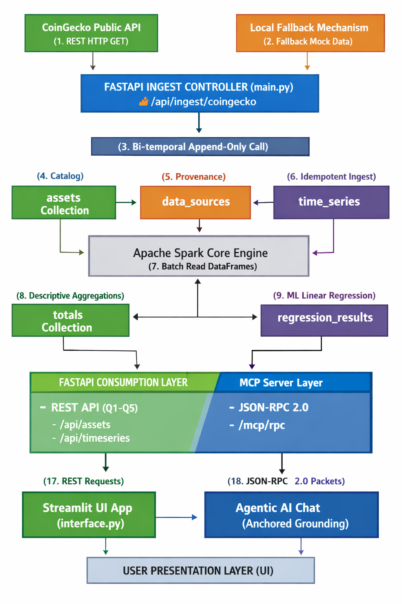

```markdown
# Acme Ltd - Financial Market Data Warehouse (DWH)
Demo video:https: //drive.google.com/file/d/1TGQzmtteSaRESwkSWw3NntkvmXVX8pvT/view?usp=sharing
[cite_start]Proiect realizat conform specificațiilor oficiale pentru gestionarea și analizarea datelor financiare bi-temporale utilizând o arhitectură modernă pe straturi.

## Arhitectura Sistemului
* [cite_start]**Stratul de Stocare:** MongoDB Atlas (NoSQL) - Model flexibil pentru date eterogene, implementat append-only .
* **Stratul Core (DAL):** `dal.py` (Data Access Layer) izolează complet operațiunile bazei de date de logica de business.
* [cite_start]**Stratul API & Servicii:** FastAPI (`main.py`) expune endpoint-urile REST (Q1-Q5) și serverul Model Context Protocol (MCP).
* [cite_start]**Stratul Analitic:** Apache Spark (`spark_analytics.py`) rulează joburi descriptive de agregare și predictive (Linear Regression).
* [cite_start]**Interfața Consumator:** Streamlit (`interface.py`) oferă o consolă agentică de control.

## Pentru partea de rulare

1. Instalați dependențele necesare din manifestul de sistem:
```bash
pip install -r requirements.txt
```

2. Pornire serverul Backend FastAPI :
```bash
uvicorn main:app --reload
```

3. Pornire interfața utilizator grafică bazată pe Streamlit UI:
```bash
streamlit run interface.py
```
4. Rulare suita de teste unitare obligatorii pentru DAL și pipeline:
```bash
python -m unittest test_dal.py

#Arhitectura Sistemului

